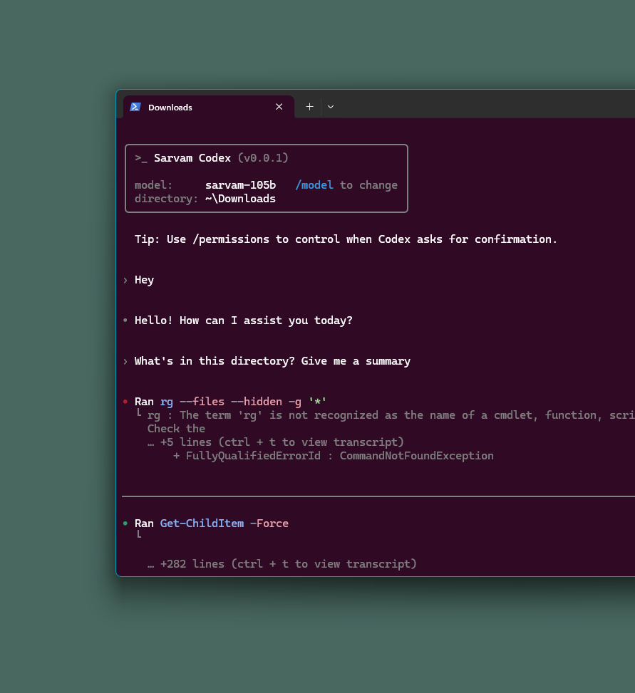

<strong>Sarvam Codex CLI</strong> is a lightweight coding agent that runs in your terminal with Sarvam AI's models

  

 
---

## Quickstart

### Installing and running Sarvam Codex CLI

You can go to the latest GitHub Release and download the appropriate binary for your platform.

Each GitHub Release contains many executables, but in practice, you likely want one of these:

* Windows

  - x86_64: sarvam-codex-x86_64-pc-windows-msvc.exe 
  - aarch64: sarvam-codex-aarch64-pc-windows-msvc.exe
* Linux
  - x86_64: sarvam-codex-x86_64-unknown-linux-musl.tar.gz
  - aarch64: sarvam-codex-aarch64-unknown-linux-musl.tar.gz
* macOS
  - x86_64: sarvam-codex-x86_64-apple-darwin.tar.gz
  - aarch64: sarvam-codex-aarch64-apple-darwin.tar.gz

Or you can just build it yourself to be on bleeding edge.